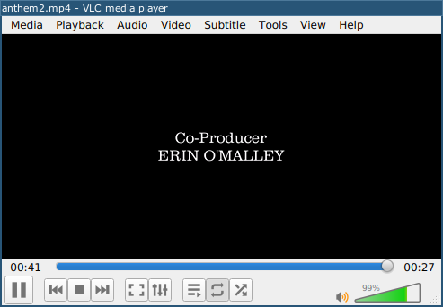

# Гимн года II: Write-up

При попытке воспроизвести 27-секундное видео в некоторых плеерах (например, VLC) до конца оно не заканчивалось: переставала играть музыка, картинка зависала на последнем кадре, а отсчёт времени продолжал идти.



Судя по всему, за концом видео действительно что-то есть. Наиболее подробно изучить метаданные видеофайла можно командой `ffprobe anthem2.mp4`. В частности, там есть такие строки:

```
  Duration: 00:00:27.07, start: 0.000000, bitrate: 171 kb/s
    Stream #0:0(eng): Video: h264 (High) (avc1 / 0x31637661), yuv420p, 1920x1080 [SAR 1:1 DAR 16:9], 36 kb/s, 0.0044 fps, 25 tbr, 12800 tbn, 50 tbc (default)
```

Указана частота кадров 0.0044 fps (то есть один кадр на примерно четыре минуты), при этом мы видели, как кадры сменяются заметно чаще. Это вкупе с незаканчивающимся отсчётом указывает на то, что истинная длительность видео намного превышает заявленную.

Для различных манипуляций с видео существует утилита _ffmpeg_. Её возможности поистине безграничны, но сейчас нам от неё нужно, чтобы она пересчитала метаданные файла без перекодировки видео и аудио в нём. Выполним команду, которая создаст новый файл нужным нам образом: `ffmpeg -i anthem2.mp4 -c copy anthem2-c.mp4`.

Посмотрим свойства нового файла: `ffprobe anthem2-c.mp4`. Видим, что длительность увеличилась до 42 часов. При попытке проиграть новый файл отсчёт никуда не убегает, а видео заканчивается чёрным кадром. Но при перематывании ничего интересного по-прежнему не видно.

Надо вытащить все кадры для спокойного изучения. Для начала посчитаем их: найдём в интернете команду `ffprobe -v error -count_frames -select_streams v:0 -show_entries stream=nb_read_frames -of default=nokey=1:noprint_wrappers=1 anthem2-c.mp4` и получим значение 675.

Теперь попробуем вытащить кадры: `ffmpeg -i anthem2-c.mp4 frame-%08d.png`. Однако эта команда будет порождать гораздо больше файлов, пытаясь ориентироваться на частоту кадров, рекомендуемую метаданными (это значение называется _tbr_ и равно, судя по информации от ffprobe, 25). Очевидно, что для размазывания 675 кадров на 40 часов при осмысленном начале видео потребуется, чтобы частота кадров была переменной, и формат MP4 действительно такую возможность поддерживает. Мы можем попросить ffmpeg при извлечении изображений пересчитать временные отметки кадров, как если бы их частота была постоянной, указав `-r 25` (или любое другое число) перед входным файлом. Полностью команда будет выглядеть так: `ffmpeg -r 25 -i anthem2-c.mp4 frame-%08d.png`. На этот раз кадров будет извлечено ровно 675.

Пролистаем их. `frame-00000601.png` выглядит так:


Снова видим заветное ~~щасло~~ _засло_, аккуратно переписываем.

Флаг: **ugra_like_and_subscribe_adacddfeaaba**.

## Постмортем

При неудачных значениях случайных чисел в генераторе задания кадр с флагом портился сжатием вплоть до полной невозможности его прочитать. В репозитории лежит исправленная версия генератора — теперь минимальный возможный битрейт гарантирует читаемость флага.
