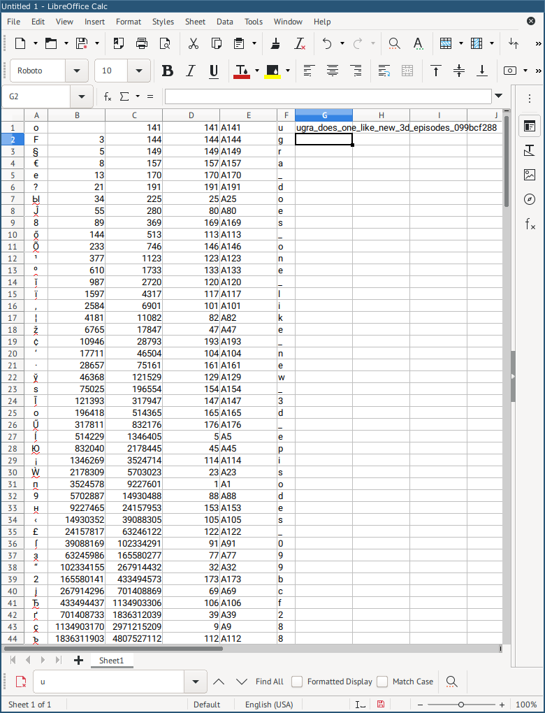

# IBM Selectric: Write-up

Распаковываем архив и открываем файл в любой программе, поддерживающей просмотр формата STL. Скажем, MeshLab.

Видим шарик с буквами. Можно заметить следующее:

* Символы организованы в пять строк, по 40 в каждой;
* Есть вертикальная граница, обозначающая, по-видимому, начало и конец этих строк;
* Символы на шарике не повторяются, кроме символа `_` — он встречается аж семь раз.

Последний факт намекает нам на то, что флаг может быть просто разбросан по шарику. Найдём на нём первые буквы `u`, `g`, `r`, `a` и ближайшее подчёркивание `_`: они будут в одной строке или в двух соседних строках. Направление указывает порядок чтения: справа налево, как если бы мы читали текст, образованный зеркальными буквами. Заодно установим правило перехода на новую строку: после конца строки, обозначенного разделителем, будем читать следующую строку, начиная с первого символа, а после конца последней строки — первую строку.

Расстояния между первыми пятью символами флага увеличиваются. От `u` до `g` надо продвинуться на 3 символа, от `g` до `r` — на 5, потом на 8, потом на 13. Воспользуемся ресурсом OEIS — энциклопедией последовательностей целых чисел; ресурс бывает очень полезен в решении задач, где последовательность построена по какому-то принципу, но мы его не понимаем. [Поищем 3,5,8,13 на OEIS](http://oeis.org/search?q=3%2C5%2C8%2C13) и обнаружим, что это идущие не совсем с начала числа Фибоначчи. Следующее число Фибоначчи — 21, пробуем продвинуться на 21 символ вперёд — и видим там букву `d`, которая вполне может быть во флаге. При продвижении ещё на 33 символа попадаем на букву `o`, и так далее.

Числа Фибоначчи растут очень быстро, а уследить за буквами и не сбиться сложно, поэтому автоматизируем процесс. Откроем табличный процессор — Excel, LibreOffice Calc или Google Sheets.

Перепечатаем буквы по порядку в колонку A (при этом непонятные символы будем отбрасывать — всё равно они не могут быть частью флага). В колонке B посчитаем наши числа Фибоначчи, указывающие расстояние между буквами: первые несколько ячеек заполним готовыми числами, а остальные — распространив формулу вида `=B4+B3` (пример для ячейки B5).

В колонке C посчитаем порядковые номера символов на шарике, разности между которыми посчитаны в колонке B: в ячейку C1 вставим номер строки для буквы `u`, а дальше будем складывать порядковый номер сверху и расстояние слева по формулам вида `=C1 + B2` (для ячейки C2). После этого в колонке D возьмём остаток от деления чисел колонки C на 200 и прибавим 1: `=MOD(D1 - 1, 200) + 1` (в русской версии — `=ОСТАТ(D1, 200) + 1`; это пример для ячейки D1). Это даст нам номер строки, из которой нужно брать очередной символ.

В колонке E вычислим адрес ячейки, прибавив букву A: `="A" & D1` (в ячейке D1). Наконец, в колонке F достанем по полученным адресам значения — наши буквы: `=INDIRECT(E1)` (в русской версии — `=ДВССЫЛ(E1)`; это пример для ячейки F1).

Дополнительно можно в какой-нибудь ячейке можно сделать `=CONCAT(E1:E44)`, получив тем самым готовый к копированию флаг.

Флаг: **ugra_does_one_like_new_3d_episodes_099bcf288**.
